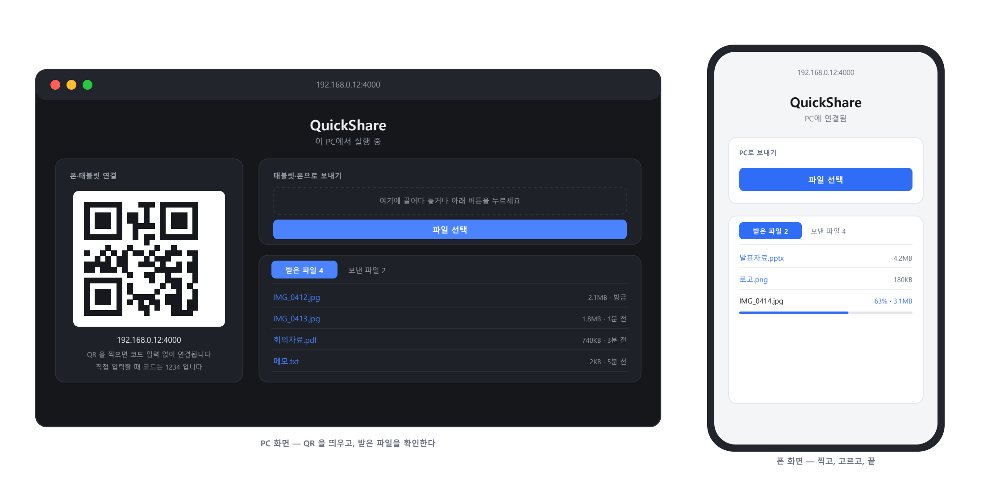

<div align="center">

# QuickShare

**케이블도, 이메일도, 앱 설치도 없이 — 폰의 사진을 PC로.**

PC 화면에 뜬 QR 을 폰 카메라로 찍으면 끝입니다.<br />
인터넷을 거치지 않고 같은 와이파이 안에서만 파일이 오갑니다.


<br /><br />



</div>

---

## 왜 만들었나

폰으로 찍은 사진을 PC 로 옮기는 일은 늘 번거롭습니다. 케이블을 찾아 꽂거나,
자기 자신에게 메일을 보내거나, 클라우드에 올렸다가 다시 받아야 하죠.

기성 도구들도 여러 이유로 막혔습니다. 어떤 것은 회사 네트워크의 보안 장비가
업데이트를 막아 실행조차 못 했고, 어떤 것은 PC 에 Wi-Fi 어댑터가 없어 안 됐고,
브라우저 기반 P2P 도구는 **양쪽 탭이 동시에 깨어 있어야 해서** 화면이 꺼질 때마다 끊겼습니다.

그래서 반대로 갔습니다. **연결을 유지하지 않는 구조**입니다.
파일을 보낼 때만 잠깐 붙었다 끊습니다. 유지하는 게 없으니 끊어질 것도 없습니다.

## 이런 점이 다릅니다

| | 일반적인 공유 도구 | QuickShare |
| --- | --- | --- |
| 서로 찾는 법 | 외부 서버가 소개해 줌 | QR 을 찍거나 주소 입력 |
| 연결 유지 | 양쪽이 동시에 깨어 있어야 함 | 유지하지 않음 |
| 전송 경로 | WebRTC · 클라우드 경유 | 같은 네트워크 안 HTTP 직통 |
| 상대 기기 준비물 | 앱 설치 | **브라우저뿐** |
| 파일이 지나가는 곳 | 남의 서버 | **내 PC 만** |

## 빠른 시작

### 1. 받기

이 저장소를 내려받아 원하는 위치에 둡니다.

### 2. Node.js 설치

[nodejs.org](https://nodejs.org) 에서 LTS 버전을 받아 설치합니다. 이미 있다면 건너뛰세요.

### 3. 실행

**`QuickShare 실행.bat` 을 더블클릭합니다.** 나머지는 알아서 처리합니다.

```
====================================================
  QuickShare 실행 중
====================================================

  [QR 코드]

  주소:      http://192.168.0.12:4000
  접속 코드:  8465
```

브라우저가 자동으로 열립니다. 그 화면의 **QR 을 폰 카메라로 찍으면** 코드 입력 없이 바로 연결됩니다.

> **첫 실행 때 방화벽 창이 뜨면 '액세스 허용'을 눌러야 합니다.**
> 여기서 취소하면 PC 에서는 열리는데 폰에서만 접속이 안 되는 상태가 됩니다.

<details>
<summary>bat 없이 직접 실행하기</summary>

```powershell
npm install
node server.js
```

| 환경 변수 | 기본값 | 설명 |
| --- | --- | --- |
| `PORT` | `4000` | 사용할 포트 |
| `PIN` | 매번 임의 생성 | 접속 코드를 고정하고 싶을 때 |

```powershell
$env:PORT=5000; $env:PIN='1234'; node server.js
```

</details>

<details>
<summary>PC 를 켤 때 자동으로 띄우기</summary>

`Win+R` → `shell:startup` → 열린 폴더에 `QuickShare 실행.bat` 의 **바로가기**를 넣습니다.
검은 창이 거슬리면 바로가기 속성에서 실행 방식을 `최소화` 로 바꾸세요.

</details>

## 화면은 보는 쪽에 따라 달라집니다

서버는 접속자 IP 로 **이 PC(host)** 인지 **다른 기기(guest)** 인지 판별합니다.
같은 폴더라도 보는 쪽에 따라 이름이 반대로 표시됩니다.
내가 보낸 것은 상대에게는 받은 것이니까요.

| | PC 화면 | 폰 · 태블릿 화면 |
| --- | --- | --- |
| 보내기 버튼 | 태블릿·폰으로 보내기 → `share/` | PC로 보내기 → `received/` |
| 받은 파일 | `received/` | `share/` |
| 보낸 파일 | `share/` | `received/` |
| 접속 코드 | 묻지 않음 | 필요 (QR 이면 생략) |

PC 앞에 앉은 사람에게 코드를 묻는 것은 의미가 없으므로,
루프백과 서버 자신의 LAN 주소에서 온 요청은 인증을 건너뜁니다.

## 폴더

| 폴더 | 내용 |
| --- | --- |
| `received/` | 상대 기기에서 이 PC 로 보낸 파일 |
| `share/` | 이 PC 에서 상대 기기로 보낸 파일 |

`share/` 는 탐색기로 직접 파일을 넣어도 됩니다. 상대 기기 화면에 바로 뜹니다.
같은 이름의 파일이 오면 덮어쓰지 않고 `사진 (1).jpg` 처럼 번호를 붙입니다.

> ### ⚠ 다시 실행하면 두 폴더를 지웁니다
>
> 실행할 때마다 새 코드와 새 QR 로 **새 세션**이 시작되므로,
> 시작 시점에 `received/` 와 `share/` 안의 파일을 모두 삭제합니다.
>
> 이 둘은 저장소가 아니라 그 세션 동안만 쓰는 **임시 공간**입니다.
> **남길 파일은 서버를 끄기 전에 다른 곳으로 옮겨두세요.**
>
> 지우지 않으려면 `server.js` 의 `clearTransferFolders()` 호출을 빼면 됩니다.

## 동작 방식

```
   폰 · 태블릿                공유기 / 스위치                  PC
      │                          │                            │
      │  ① QR 스캔                │                            │
      │     http://192.168.0.12:4000/?code=1234                │
      ├─────────────────────────►│───────────────────────────►│
      │                          │                       ② 코드 검증
      │◄─────────────────────────│◄───────────────────────────┤
      │     쿠키(토큰) + 화면      │                            │
      │                          │                            │
      │  ③ PUT /api/upload        │                            │
      │     (파일 본문 그대로)      │                            │
      ├─────────────────────────►│───────────────────────────►│
      │                          │                     received/ 에 기록
```

파일을 고르면 `PUT /api/upload` 로 본문에 파일을 그대로 실어 보내고,
서버는 그 스트림을 목적지 폴더에 바로 기록합니다.
multipart 파싱이 없어서 큰 파일도 메모리에 올라가지 않습니다.

목록은 5초마다 갱신되고, 업로드가 끝나면 즉시 한 번 더 갱신합니다.
새 파일이 도착하면 `받은 파일` 탭이 세 번 깜빡여 알려줍니다.

<details>
<summary>API</summary>

| 메서드 | 경로 | 설명 |
| --- | --- | --- |
| `GET` | `/api/session` | `{ authed, role, connect }` — `connect` 는 host 에게만 |
| `POST` | `/api/auth` | `{ pin }` → 성공 시 `qs_token` 쿠키 발급 |
| `GET` | `/api/qr` | 접속용 QR (SVG). **host 에게만** — 코드가 들어 있으므로 |
| `PUT` | `/api/upload?name=` | 본문이 곧 파일 |
| `GET` | `/api/files?box=` | `received` 또는 `share` 의 목록 |
| `GET` | `/api/download?box=&name=` | 파일 내려받기 |

`box` 는 화이트리스트로만 실제 경로가 되므로 `?box=..\..\Windows` 같은 시도는 400 으로 막힙니다.

</details>

## 잠금

- 코드가 맞으면 **12시간짜리 토큰**을 쿠키로 발급합니다. 한 번 입력하면 다시 묻지 않습니다
- 코드 비교는 해시 후 `timingSafeEqual` 로 합니다
- 한 IP 에서 **10회 틀리면 10분간 차단**됩니다
- 업로드 파일명은 경로 요소와 Windows 금지 문자를 제거한 뒤 저장합니다
- 접속 코드는 실행할 때마다 새로 만들어집니다

> **HTTP 평문입니다.** 집이나 사무실처럼 믿을 수 있는 네트워크에서만 쓰세요.
> 카페나 공항 같은 공용 와이파이에서는 사용하지 마세요.

## 안 될 때

| 증상 | 확인할 것 |
| --- | --- |
| 검은 창이 바로 닫힘 | Node.js 가 설치되어 있는지 |
| PC 는 되는데 폰만 안 됨 | 방화벽에서 node.exe 인바운드를 허용했는지 |
| 폰에서 주소가 안 열림 | 폰이 같은 와이파이인지. LTE 로는 안 됩니다 |
| QR 이 안 읽힘 | 카메라 설정에서 QR 스캔이 켜져 있는지 |
| `이미 실행 중` 이라고 뜸 | 정상입니다. 브라우저만 다시 열립니다 |
| 파일이 안 보임 | 다시 실행하면 목록이 비워집니다 |

방화벽 규칙을 직접 추가하려면:

```powershell
New-NetFirewallRule -DisplayName "QuickShare" -Direction Inbound -Protocol TCP -LocalPort 4000 -Action Allow
```

와이파이에 **클라이언트 격리(AP isolation)** 가 걸려 있으면 기기끼리 서로 닿지 않습니다.
이 경우 로컬 전송 방식으로는 해결할 수 없습니다. PC 에서 상대 기기로 닿는지 확인:

```powershell
Test-NetConnection -ComputerName <상대기기IP> -InformationLevel Detailed
```

## 문서

| 문서 | 대상 |
| --- | --- |
| [설치문서.pdf](설치문서.pdf) | 처음 쓰는 사람 — 인쇄해서 건네도 됩니다 |
| [개발문서.md](개발문서.md) | 이어서 개발할 사람 — 설계 근거와 함정까지 |

## 기여할 때 알아둘 것

`QuickShare 실행.bat` 은 **CP949 인코딩 + CRLF 줄바꿈**이어야 합니다.
UTF-8 이나 LF 로 저장하면 cmd 가 파싱하지 못해 실행되지 않습니다.
`.gitattributes` 가 줄바꿈은 지켜주지만, 인코딩은 편집기에서 직접 확인해야 합니다.
